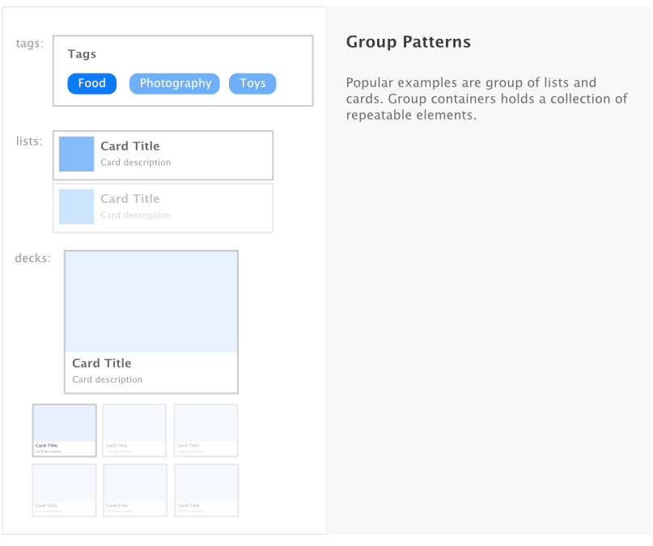
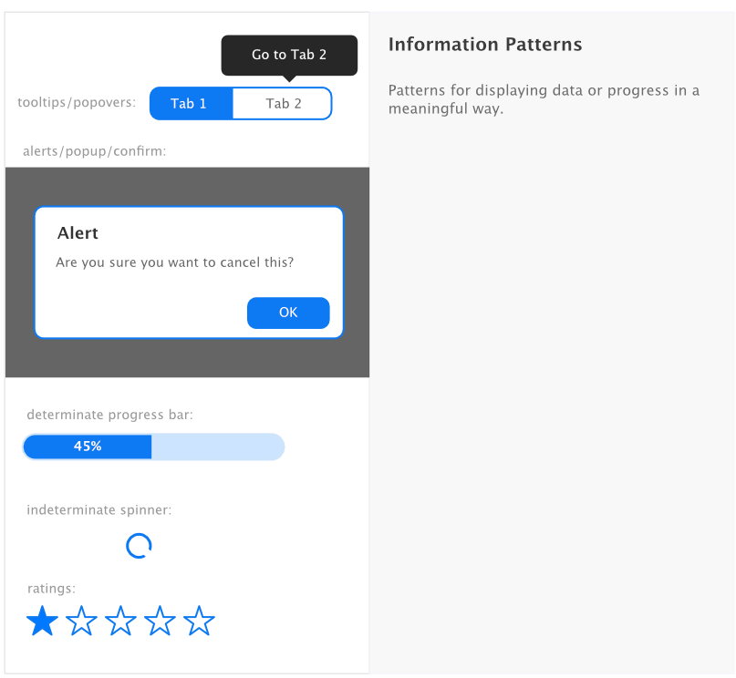
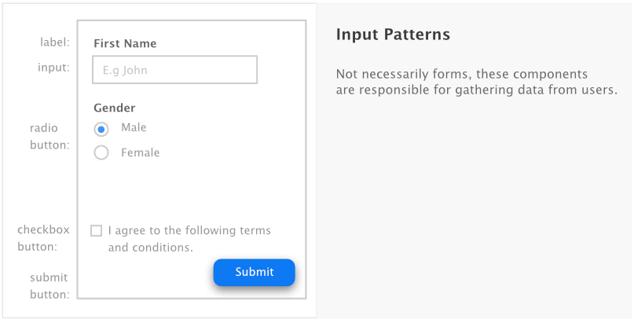
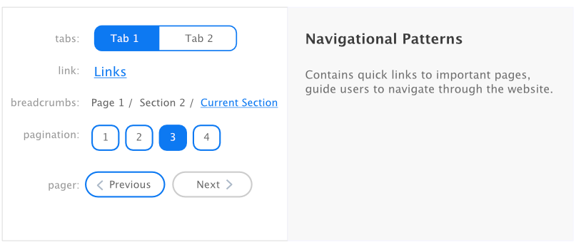

# Patterns in UI Design

## A collection of common UI patterns found in development/designing.

Samples of UI Patterns, separated into their respective domain:

## Common Mistakes in the Design Process
### Text Patterns

#### Character limits

When designing a component with text, always define the character limit.

Else you'll end up with a perfect design that will malfunction in the real-world scenario...

**Bad**

The same issues can be found if users did not enter any spacing in the word.

**Good**

A good practice is to limit the character counts, or setting an ellipsis (three dots at the end of the text...).
Limiting the text to two lines is another alternative, but not possible without any hacks on the web.

#### Unicode Characters

When designing cross-platform apps, the users can enter unicode characters (emotions, emojis etc) through the mobile, which
might not be supported on the web.

An options is to use libraries that supports fonts on the web or disabled it directly. 

Depending on your business requirements, you might want to prevents users from entering emojis on sensitive fields like name or password. 

Be careful when handling multilingual too. Some text might be shorter in one language (like chinese), or might be displayed in the opposite direction (right to left a.k.a rtl) jawi).

#### Singular/Plural Handling

It's important to handle singular and plural naming in the design.

| Range | Displayed as | 
|-------|--------------|
| count === 0 | 0 Comments |
| count === 1 | 1 Comment |
| count > 1 | 2 Comments, 3.5k Comments |

When appropriate, you can choose to omit them too. E.g.

When doing multilingual, this becomes slightly more troublesome as different language has different pluralization. 

1. Set `min` and `max` length for each text fields. E.g. a `first name` and `last name` field cannot be empty.
2. Be careful when saving user fields such as `first_name` and `last_name` in NoSql. If the fields changed, any other collection that contains the fields have to be updated.
3. Text without character limits will break the UI. Imagine a 5k long name on your Facebook.
4. Empty names can break your UI too. Imagine when someone visited your profile and did not find a name.
5. __Long comments__. When having a display that is full of words, consider hiding part of it (3 lines or 200 characters) showing a `Show More`/`Show Less` toggle. Users don't need to see the full text.
6. __Untrimmed text__. Always trim your text before saving them to the DB. Also, trim your text before checking the length, as an empty space will have a text length of 1. Image typing lots of space before typing the actual comment - You will end up with a lot of blank space.
7. empty submit. dont allow user sto submit empty stuff. disable the button accordingly.
8. cant press enter for forms since it is disabled.

## Numbers issue

1. For best practice, always set a `min` and `max` for number inputs.
2. Depending on business logic, you might want to set the `min` value to 0. E.g. in an e-commerce application, the number of items in the basket cannot be negative values. It should also not be more than the limited amount.
3. Always carry out server-side validation.
4. Use libraries for calculation, as decimal math works differently in JavaScript. See [here](http://adripofjavascript.com/blog/drips/avoiding-problems-with-decimal-math-in-javascript.html).
5. Be careful when adding events that increment/decrement counts (E.g. a like button). Performing this actions will cause the numbers to be wrong.
6. Carry out validation on the server side - you don't want users to manipulate your items count when purchasing item in the cart.

## Date Issues

1. Store UTC time in the database, and convert it to GMT when displaying on the client side. 
2. Date of birth cannot be today.
3. Always compare the time on the server side when checking expiry - E.g. Ticket system, cinema booking system. Let's say you created an event that will last until tomorrow, but you leave your browser on the event page itself for 3 days, untouched. When you come back 3 days later, can you still perform action on the event?
4. Limit the time user is on the payment page/pages with items that will expired. Kick them out after certain threshold have been achieved.

## Login issues

1. User `A` logs in the website. Then the user press the back button - user `A` is redirected back to login page.
2. User `B` logs out of the page. Then the user press the back button - user `B` is still logged in.
3. User `A` logs in. User `B` can still access the login page. User `B` can log in.
4. User `A` is logged in. User `A` has the same page opened on multiple tabs. User `A` logs out. But user `A` is still logged in other pages.
5. code to kick users out from all tabs.

## Block issue

1. You implemented a logic to block people from viewing your profile, can the user still view your profile if the user is not logged in? Solution: Implement private security - disable anonymous user from viewing your profile.

## Throttle/Debounce

Scenario: You want to prevent submitting multiple request/rate-limit your actions when performing an action.
Application: Search input (when sending requests), resizing window (will only perform action after user stops resizing)

TODO: Show two ceodes example.

## CRUD issues

1. __Real time issue__. User `A` delete an item on a page. User `B` can still see the item and perform action if the page is not refreshed.
2. __Cached issue__. User `A` update his profile photo. The photo however is not reflected on other pages since it is cached.
3. __Slow reflection__. User `A` update a field. But user `B` did not saw the changes.
4. __Slow delete__. User `A` create an item and shared the link to user `B`. User `A` then delete the item. User `B` saw 404 page. User `B` is expected to be shown a `Item has been deleted or does not exist` page.
5. __Simultaneous creation__. User `A` create a new comment. But the view on User `B` is still not updated. User `B` enters a new comment too. When the page refreshes, the order of the items are not in the expected order. also possible to have duplicate orders, for example a booking system. 
6. __Double click__. The most common patterns for newbies. User can submit the form twice by double-clicking with their gaming mouse. 
7. Websocket for refreshing views. if you have a feed page, any changes you made on your side will not be reflected n the other users side.
8. expired items. a very common issue. you have an item that will expire in 5 minutes. you are on that page before it expires. 10 minutes later, you perform an action.

## Single page application

1. __Router Issue__. Single page application usually have a router. Always disable the click if the user is already on the specified tab, as it will mess up the browser history. todo: example code. discussion, sometimes you want user to refresh the tab on click, so it might be sensible to NOT disable the click.
2. __Logout issues__. Perform a page refresh when doing a logout. Just swapping views will not help, as user can press the browser back button.
