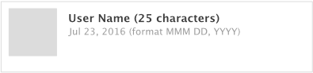
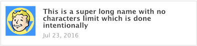
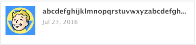
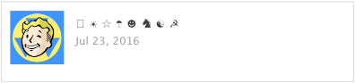

# Patterns in UI Design

## A collection of common UI patterns found in development/designing.

### Text Patterns

**1. Character limits**

When designing a component with text, always define the character limit.

Else you'll end up with a perfect design that will malfunction in the real-world scenario...

**Bad**

The same issues can be found if users did not enter any spacing in the word.

**Good**

A good practice is to limit the character counts, or setting an ellipsis (three dots at the end of the text...).
Limiting the text to two lines is another alternative, but not possible without any hacks on the web.

**2. Unicode Characters**

When designing cross-platform apps, the users can enter unicode characters (emotions, emojis etc) through the mobile, which
might not be supported on the web.

An options is to use libraries that supports fonts on the web or disabled it directly. 

Depending on your business requirements, you might want to prevents users from entering emojis on sensitive fields like name or password.

**3. Singular/Plural Handling**

It's important to handle singular and plural naming in the design.

| Range | Displayed as | 
|-------|--------------|
| count === 0 | 0 Comments |
| count === 1 | 1 Comment |
| count > 1 | 2 Comments, 3.5k Comments |

When appropriate, you can choose to omit them too. E.g.

